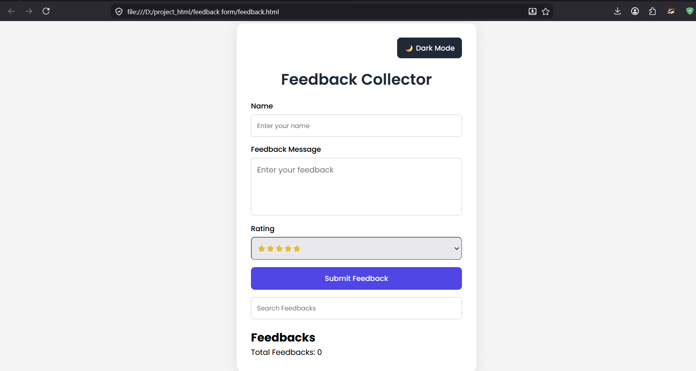
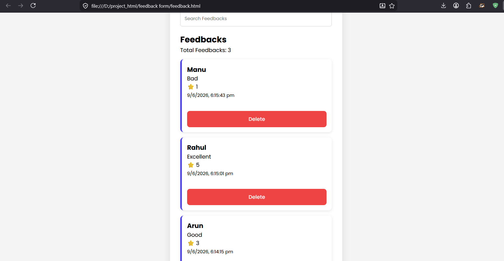
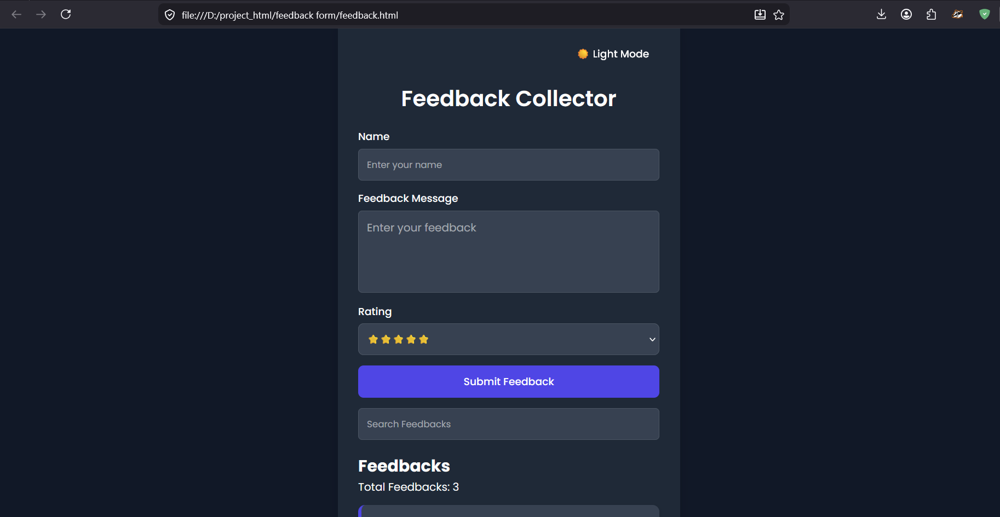
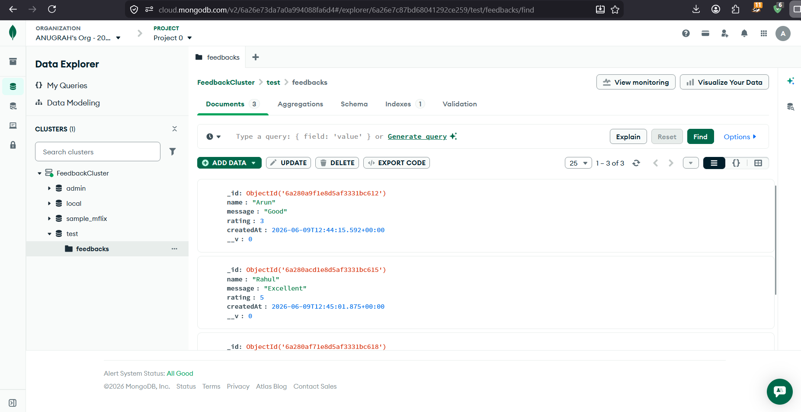

# Feedback Collector

A Full Stack Feedback Collection Application built using HTML, CSS, JavaScript, Node.js, Express.js, and MongoDB Atlas.

## Features

~ Add Feedback

~ View All Feedbacks

~ Delete Feedback

~ Search Feedbacks

~ Dark Mode Toggle

~ MongoDB Atlas Integration
## Screenshots

### Feedback Form


### Feedback List


### Dark Mode


### MongoDB Database


## Technologies Used

- HTML5
- CSS
- JavaScript
- Node.js
- Express.js
- MongoDB Atlas
- Mongoose

## Project Structure

feedback-collector/
│
├── feedback.html
├── feedback.css
├── script.js
│
└── backend/
    ├── server.js
    ├── package.json

## Installation

1. Clone the repository

```bash
git clone https://github.com/anugrehh/feedback-collector.git
```
2. Install dependencies
   
```bash
npm install
```
3. Start server
   
```bash
node server.js
